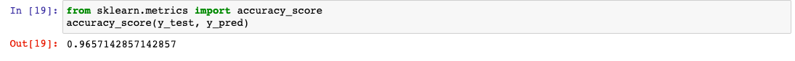
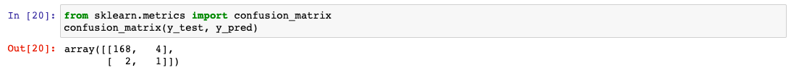
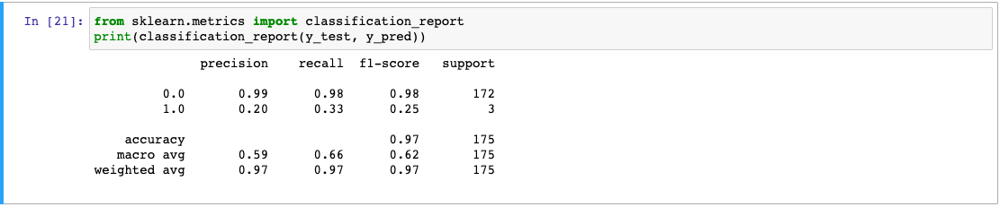

# Music-and-Mental-Health-Analysis

## Overview

The purpose of this analysis is to uncover trends with music and mental health. Subjects were surveyed and provided personal information, musical preferences and levels of mental illness on a scale of 1-10. Results are stored in a dataset provided by kaggle.com. 

Our presentation slide deck can be seen here:

https://docs.google.com/presentation/d/1_F85WKOYf0-_r0zClQQ75hYl8oIgQtQtSywZXXeDdTw/edit?userstoinvite=noellewright81%40gmail.com&actionButton=1#slide=id.g241bfa74cdf_0_130

## Working Tableau Dashboard link

Our vizualizations for our presentation can be found by using the link below:

https://public.tableau.com/views/WorkingDashboardforMusicandMentalHealth/StreamingServicesPieChart?:language=en-US&publish=yes&:display_count=n&:origin=viz_share_link  

## Diagram for Exploratory Analysis and Visualization

## Projected Visualizations

Using the information from our data source, we will be providing the following visualizations made with Tableau:

* Heatmap

* Piechart

* Bar Chart

## Machine Learning Mockup

The goal of our machine learning model is to predict how a persons’ mental health is affected given their music preferences. The three outcomes as presented in the data are: No effect, improve or worsen. Given that we are trying to have our machine learning model predict data that is already present in our output data, the best model would be a supervised machine learning model. The type of problem it will be analyzing is a classification problem.

### Models

Given that we are giving our data a classification model of supervised learning, one option would be a Support Vector Machine (SVM). The benefit of SVM versus other linear regression models is that SVM can work with non-linear data.  A possible disadvantage to using this model is that if our dataset has high dimensionality, this model could under-fit the data. For this model to function properly, we will be pre-processing our data such that all the text values are all numeric values. We can use either LabelEncoder() or OneHotEncoder() to perform these tasks. Once our input data has been cleaned, we can build our model using sklearn to create training and testing subsets. SQL will also be used to make tables for the dataframe. Finally, we will fit our training data into the model in order to make predictions.

### First Attempt Results

The following images show the results from the first attempt of the machine learning model. 

- Accuracy Score

- Confusion Matrix

- Summary Statistics

### First Attempt Summary

From the images displayed above, we can see that the machine learning model was 96% accurate. Looking at the summary statistics, however, we can see that the model is 99% precise when predicting neutral and negative outcomes on mental health versus 20% precision when predicting positive outcomes on mental health.

In the next attempt, we are going to leave the musical_effect column out of the encoding to see if that changes the results. We predict that by doing this, it will make our machine learning model more accurate with predicting positive outcomes. 

## Next Steps

Our next steps in finalizing this analysis is to do the following:

- Add more visualizations to our dashboard to create a picture of users' mental health status and musical preferences
- Optimization of our Machine Learning Model
- Connecting our database to a cloud based server (AWS)
