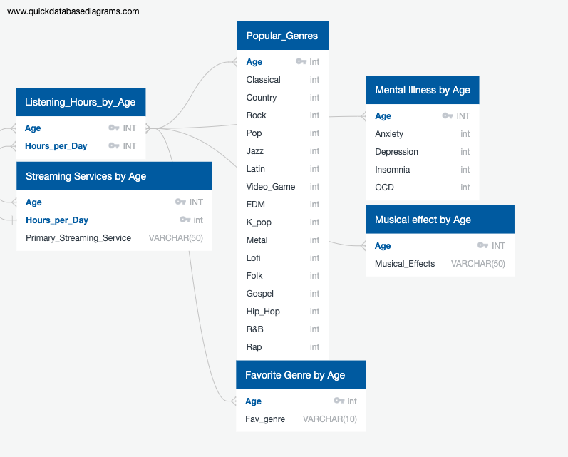

# Music-and-Mental-Health-Analysis

## Overview

The purpose of this analysis is to uncover trends with music and mental health. Subjects were surveyed and provided personal information, musical preferences and levels of mental illness on a scale of 1-10. Results are stored in a dataset provided by kaggle.com. TesTing

## Diagram for Exploratory Analysis and Visualization

